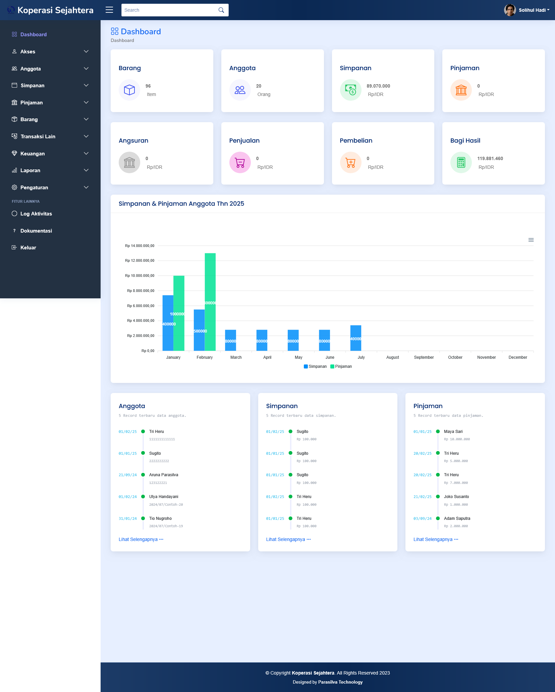

# Aplikasi Koperasi V 3.0.0
Aplikasi Koperasi V 3.0.0 adalah sebuah aplikasi open source yang dirancang untuk membantu pengelolaan koperasi secara digital. Aplikasi ini dibangun menggunakan teknologi modern seperti PHP, MySQL, jQuery, dan Bootstrap 4 untuk memberikan pengalaman pengguna yang responsif dan mudah digunakan. Aplikasi ini cocok digunakan oleh koperasi simpan pinjam, koperasi serba usaha, atau koperasi konsumen yang membutuhkan sistem pengelolaan terintegrasi.

## Fitur Aplikasi
1. **Akses**    
    - Fitur Aplikasi  
    Berfungsi mengelola kode otentifikasi pada masing-masing halaman.
    - Entitas Akses  
    Berfungsi untuk mengelola entitas/level akses (pengurus) sehingga memungkinkan masing-masing mempunyai hak akses yang berbeda sesuai tugasnya.
    - Akses/Pengguna  
    Berfungsi mengelola semua data akses pengguna pada level (Pengurus)
2. Anggota
   - Anggota  
     Berfungsi untuk mengelola semua data anggota, input data anggota, ubah dan hapus. Terdapat filter untuk pencarian, import untuk memasukan data dari excel dan export ke data excel.
   - Keluar & Masuk   
     Menampilkan rekapitulasi data keluar-masuk anggota berdasarkan periode waktu tertentu.
   - Rekap Anggota   
     Menampilkan rekapitulasi jumlah anggota keluar dan masuk berdasarkan divisi/unit kerja (untuk koperasi karyawan)
3. Simpanan Anggota
   - Jenis Simpanan  
     Halaman yang berfungsi untuk mengelola jenis-jenis simpanan yang berlaku di koperasi. Misanya simpanan pokok, simpanan wajib, simpanan sukarela, simpanan hari raya dan lain-lain.
   - Simpanan Wajib  
     Setelah anda mengelola jenis-jenis simpanan, maka anda akan tahu pada beberapa jenis simpanan tersebut terdapat simpanan yang rutin dibayarkan anggota. Halaman ini berfungsi untuk mengelola data simpanan wajib dan menambahkan data secara simultan untuk seluruh anggota.
   - Log Simpanan 
     Halaman ini berfungsi untuk mengelola data simpanan anggota secara reguler (satu per satu) untuk semua jenis simpanan yang sudah anda atur sebelumnya.
   - Rekap Simpanan 
     Halaman ini berfungsi untuk mempermudah anda melakukan monitoring jumlah simpanan anggota. Sistem dapat menampilkan jumlah simpanan berdasarkan jenis-jenisnya pada masing-masing unit/divisi (untuk koperasi karyawan) dan juga berdasarkan list anggota.
4. Pinjaman Anggota
   - Jenis Pinjaman 
     Fitur jenis pinjaman berfungsi untuk menyimpan paket pinjaman yang disediakan koperasi dengan pengaturan persentase jasa dan pengaturan periode angsuran secara khusus. Dengan adanya jenis pinjaman akan mempermudah pengurus koperasi ketika dibuatkan sesi pinjaman, karena akan langsung menyesuaikan dengan pengaturan jenis pinjaman yang telah diibuat. Walaupun demikian, pengurus koperasi masih dapat melakukan perubahan pada sesi pinjaman secara spontan jika dibutuhkan.
   - Sesi Pinjaman 
     Setiap data pinjaman anggota, dicatat pada sesi pinjaman. Fitur ini berfungsi mencatat besaran nilai pinjaman anggota, tanggal jatuh tempo, angsuran yang harus di bayar, lama periode angsuran dan status pinjaman anggota (Lunas, Masih Berjalan).
   - Tagihan/Tunggakan 
     Untuk mengetahui siapa saja anggota koperasi yang menunggak atas pinjaman yang dilakukan, maka diperlukan halaman yang melakukan rekapitulasi data tunggakan ini. Indikator tunggakan ditunjukan apabila anggota bersangkutan belum membayar angsuran sesuai tanggal jatuh tempo. Pada modul ini juga anda bisa melakukan input angsuran secara multiple, jika pembayaran angsuran serentak.
   - Rekap Pinjaman 
     Halaman rekap pinjaman berfungsi untuk menampilkan data rekapitulasi pinjaman anggota berdasarkan periode waktu tertentu. Pada halaman inii terdapat 3 fitur data yang ditampilkan, yang diantaranya adalah : Rekap jumlah data pinjaman secara keseluruhan, rekap data pinjaman berdasarkan unit kerja/ divisi, rekap data pinjaman berdasarkan anggota.
5. Barang/Inventory
   - Master Barang 
      Halaman master barang berfungsi untuk mencatat semua item barang jualan yang ada. Informasi yang dicatat terdiri dari kode, nama, kategori, stok, satuan, harga beli dan modul tambahan seperti multi harga dan multi satuan. Pada halaman ini anda juga dapat mengatur jenis-jenis harga yang berlaku.
   - Batch & Expired 
    Halaman Batch & Expired berfungsi untuk mengelola daftar batch barang serta informasi expire date sehingga jumlah barang yang expire dapat dimonitoring dengan mudah.
   - Stock Opename
   - Supplier
6. Transaksi Operasional
   - Kategori Operasional
   - Transaksi Operasional
   - Rekap Transaksi
7. Transaksi Jual/Beli
   - Transaksi Penjualan
   - Transaksi Pembelian
   - Rekap Transaksi
8. Pembukuan Keuangan
   - Bagi Hasil (SHU)
   - Akun Perkiraan
   - Jurnal Keuangan
9. Laporan
   - Simpan Pinjam
   - Buku Bessar
   - Neraca Saldo
   - Laba Rugi
   - Riwayat Transaksi
10. Pengaturan Aplikasi
   - Pengaturan Umum
   - Auto Jurnal
   - Email Gateway
11. Log Aktivitas
12. Konten Bantuan
13. Profil Pengguna

## Instalasi
### Persyaratan Sistem
- PHP 7.4 atau lebih baru
- MySQL 5.7 / MariaDB 10.3 atau lebih baru
- Web Server : Wampserver, Xampp
### Tahapan Instalasi
- Instal webserver (Xampp, Wamp) terlebih dulu kemudian jalankan.
- Simpan folder aplikasi pada directory htdoc (untuk pengguna xampp) atau www (untuk pengguna wamp).
- Masuk ke database mnggunakan phpmyadmin dengan cara ketik localhost/phpmyadmin
- Buat database baru dengan nama apapun (Misalnya : koperasi_v3)
- Import database aplikasi (database standar aplikasi ini disimpan pada folder db).
- Atur variabel koneksi database aplikasi pada file _Config/Connection.php
- Ubah nama database sesuai nama database yang tadi di buat (Misalnya : koperasi_v3).
- Buka aplikasi dengan cara ketik localhost/{nama_folder_aplikasi}
- Lakukan login untuk pertama kali dengan memasukan email : dhiforester@gmail.com dan password : dhiforester

